# SenseVeil AI RC3 — design and reliability audit

3 October 2026. Scope: the native Android scan → capture → review flow, camera-access recovery, and Tools at 200% system font size. The existing cyan/dark SenseVeil design and all detection/evidence features are retained.

**Verdict: ready for RC3 phone field testing.** Both jobs in the final CI run passed, with 43 passing checks in total. The five flows below are usable in the tested emulator configuration; physical measurement accuracy, battery behaviour and hardware integration still require device testing.

## Confirmed code risks and changes

- **Saving vs housekeeping:** age/quota cleanup could delete an active event before its post-window finished. Active captures and matching archive names are now protected. Whole completed items are still eligible; a temporary quota overrun is preferred to destroying an in-flight capture.
- **Rotation vs recovery:** a new Activity could treat the preceding Activity's still-open session as interrupted. Process-owned live session IDs are excluded, and housekeeping is serialized with evidence writes off the main thread.
- **Capture timing:** the saved event uses the sensor/profile snapshot from the trigger, not whichever values happen to exist when image saving finishes. A new capture cannot start after the Activity leaves the foreground; already-started sealing continues.
- **Camera access:** denial has an explicit recovery control and does not block saved evidence. The Settings return path rechecks access and starts scanning without requiring an app restart. The capture button reflects camera readiness.
- **Large text:** fixed-height controls can crop larger labels. Buttons now retain a 48 dp minimum while wrapping to their content. Device Support uses the common scrolling detail panel with a persistent Close control.

- **Photo review:** the old preview ignored JPEG orientation. Display copies now apply all EXIF rotations and reflections, with bounded decoding. The original signed photo is never rewritten. The device regression checks all eight orientations, invalid input, bounded previews and a signed selected-event photo in the review screen. The transform follows [Android ExifInterface documentation](https://developer.android.com/reference/androidx/exifinterface/media/ExifInterface#getRotationDegrees()).

## Five-step visual audit

The following findings come from the current RC3 emulator audit. Camera images are Android emulator patterns; the event-review image and scores are explicit test fixtures, not detections of real people. Historical RC2 screenshots and the user's private phone photos are not included in this public report.

### 1. Camera access and recovery — good

The denied state clearly names the missing camera permission, supplies a Camera access control, and keeps Events/Tools available. The recovery dialog explains Retry and Settings. Returning from Settings to the original Activity restores the camera preview and enables capture without relaunching the app. Both standalone permission checks passed. The temporary “learning” sensor state after recovery is intentional baseline calibration. OEM permission dialogs and TalkBack still need physical-device checks.

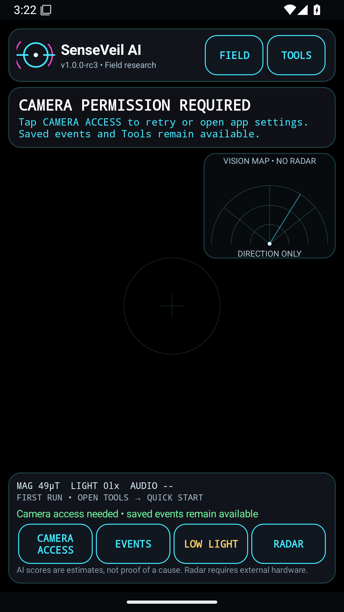

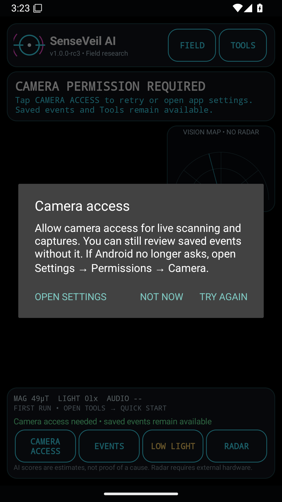

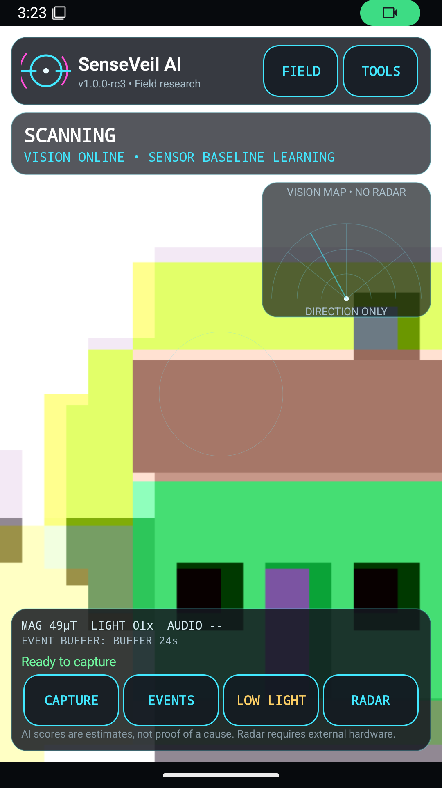

### 2. Scan and capture — good in both tested orientations

The portrait scan has a clear status heading, profile/fusion score and separate Ready to capture message. The vision map explicitly says NO RADAR and DIRECTION ONLY; the main capture actions remain above the navigation bar. Sensor values and the bottom explanatory text are smaller than the primary controls, so readability outdoors still needs a real-phone check.

The final landscape screenshot contains a processed camera frame, a fusion result and reachable controls. The header and footer leave less space for the scene in landscape; a more compact layout could improve extended use. An earlier screenshot taken before camera readiness was rejected and is not included. A separate native regression successfully captured, rotated the Activity, waited for sealing and verified the signed bundle. New capture requests while stopped are rejected.

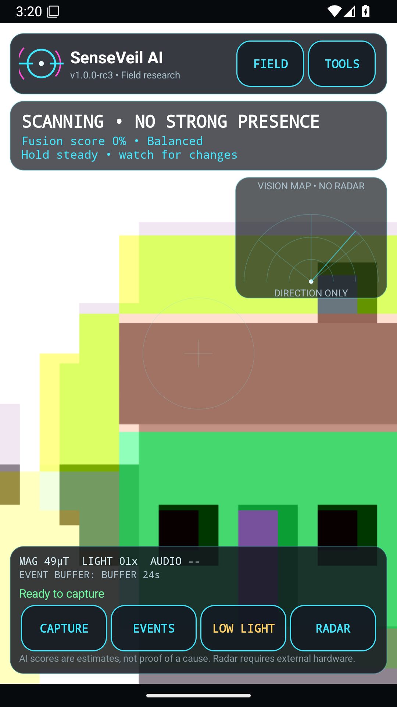

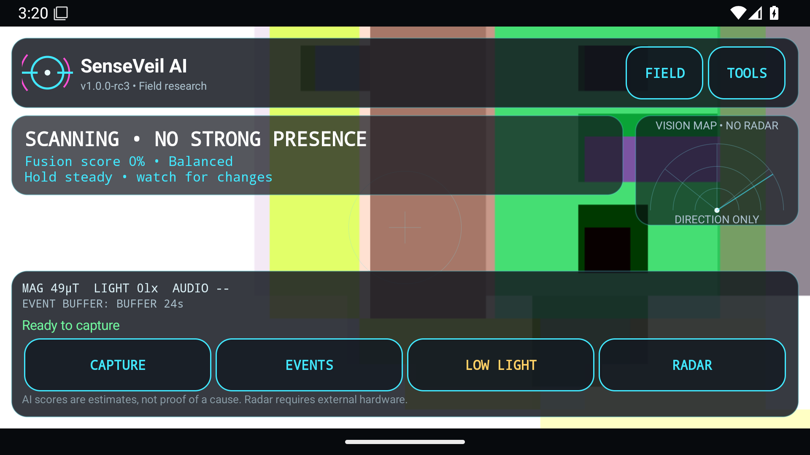

### 3. Choose an event — good

Cards show time, score/profile, an explanation and a written sealed/unsealed state. Review, Verify and Share act on the chosen event. The newest incomplete event has disabled Verify/Share while the earlier sealed event remains usable; the test verifies and exports that earlier event. The fixed Close control remains reachable.

At 200% font size, text wraps and action labels remain readable. The unavailable-file fixture retains its event log and explicitly disables file-dependent actions. Longer sessions will require more scrolling; search/filter usability for very large histories was not tested here.

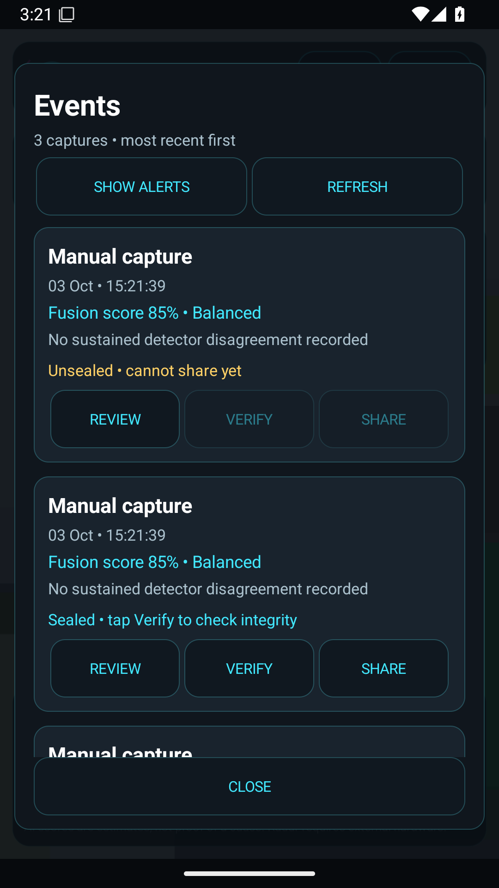

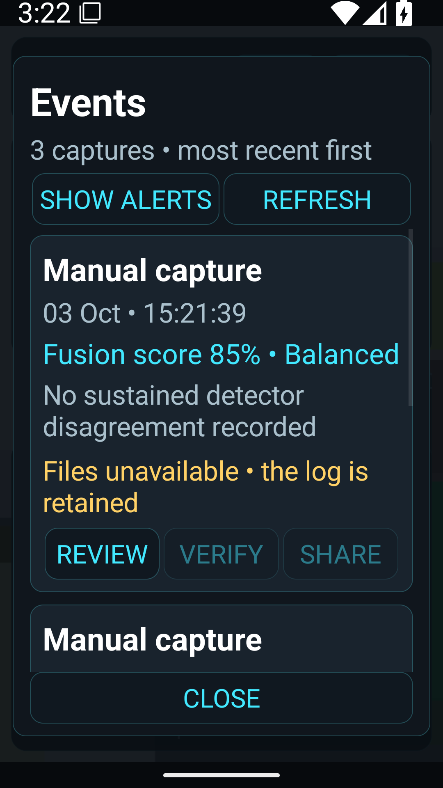

### 4. Review and verify — good, with technical language

The selected image appears upright above the event summary. Tests check all eight EXIF orientations, bounded decoding, invalid images and unchanged original bytes; the reviewed fixture's signature still verifies afterwards. The result panel identifies the selected bundle, validity, local-key trust and signer fingerprint.

The Verify text is deliberately technical and the file identifier wraps across lines. It is usable for an operator but could benefit from a short plain-language explanation in a future version. A cryptographically valid signature does not prove the real-world cause or an independent timestamp. The share regression checks the selected ZIP's contents; delivery through third-party share targets still needs the phone.

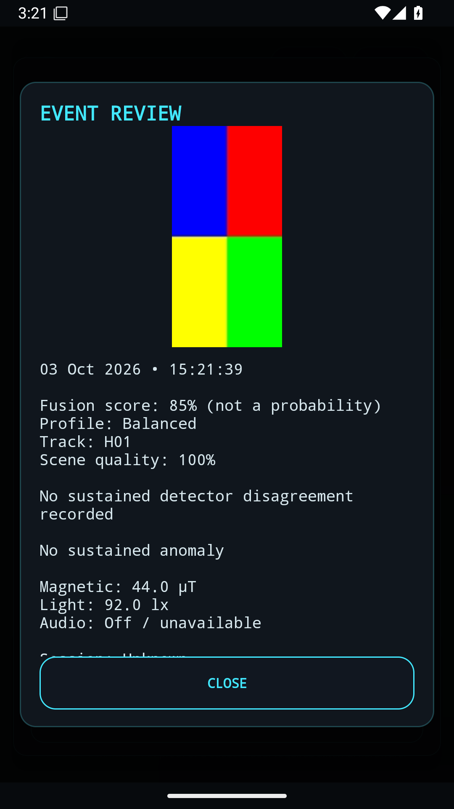

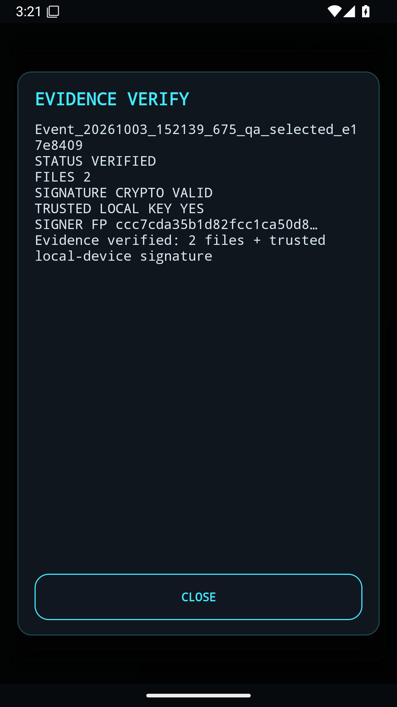

### 5. Tools and large text — good for the tested flows

Grouped sections separate scanning, signer trust and device/help actions. The Tools list scrolls to Quick Start and diagnostics, and Back returns through the overlays. At 200% font size, long button labels wrap without losing their action; Device Support scrolls its report while Close remains visible. The test also opens and closes Events at that size.

Tools remains a long list, especially with enlarged text. TalkBack order, switch access, contrast over varied camera scenes and enlarged-text landscape scanning were not assessed. The grey secondary text and translucent scan panels warrant outdoor testing. This is not a full accessibility certification.

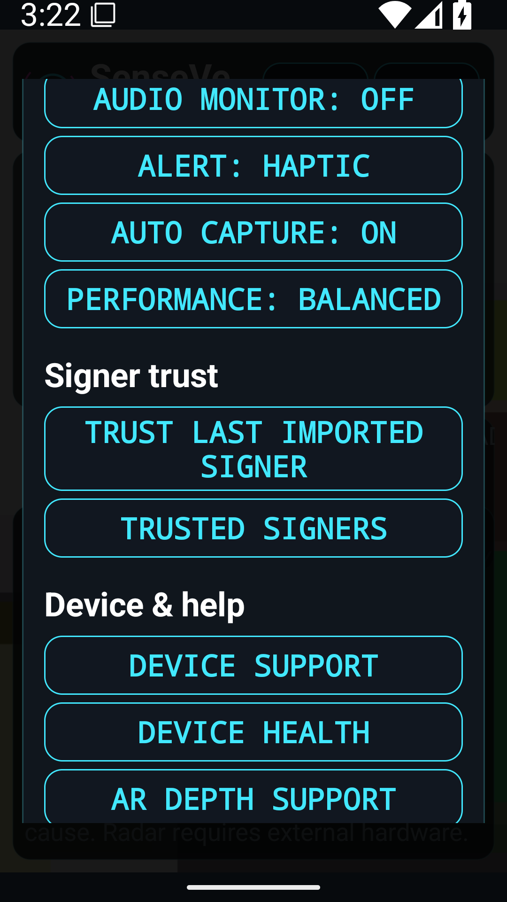

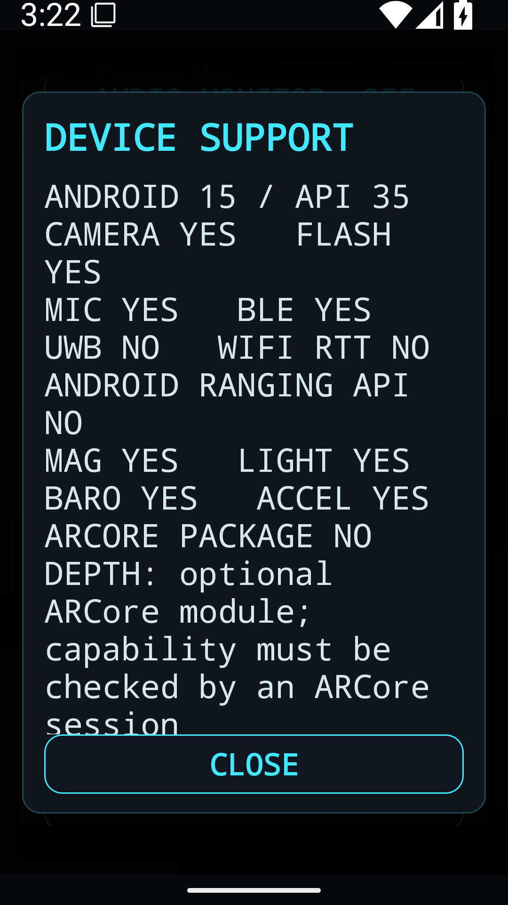

## Test coverage

Four new JVM regressions exercise pending retention, quota pressure, release of protection, whole-item deletion and preservation of unrelated content. Android regressions exercise live-session recovery, large-text Tools/report/history, and background capture rejection alongside existing crypto, pose, capture/rotation, per-event export and navigation tests.

| Preserved feature | Automated coverage / remaining check |
| --- | --- |
| Multisensor fusion and anomaly consensus | Scorer, frame/duration gates, identity/profile/pause resets; physical sensor calibration still needs field testing. |
| Evidence signing and encryption | Manifest/extra-file/tamper rejection, Android Keystore signing, AES-GCM round trip and corrupt-tag rejection. |
| Chain of custody and replay | Numeric canonicalization, modification/tail-truncation checks, signed session closure and live-session recovery. |
| External radar/thermal protocol | Parsing, sequence/freshness guards, malformed/non-finite values and metadata downgrade rejection; vendor hardware transport remains an integration interface. |
| AR depth capability | Existing capability probe retained; requires compatible physical ARCore hardware to exercise. |
| Capture, event review and diagnostics | Emulator capture across rotation, foreground guard, selected-event verify/export, preview integrity, navigation and diagnostic bundle creation. |

The emulator-only permission smoke script denies camera access, opens saved Events, enters app Settings, grants access while the original Activity is stopped, and returns with Back. It deliberately does not relaunch the Activity, so it tests the resume path.

## CI interruption investigated

The first RC3 device run [37118108953](https://github.com/Wrekin-Labs/andys-bot-updates/actions/runs/37118108953) failed four UI tests because a Pixel Launcher ANR covered the app. Saved failure screenshots and logcat identify `com.google.android.apps.nexuslauncher`; this failed run is not counted as a pass. The harness now dismisses only that exact launcher dialog on emulators, never an app ANR. Device APKs compile before emulator startup to reduce contention. The next run [37119070936](https://github.com/Wrekin-Labs/andys-bot-updates/actions/runs/37119070936) passed all nine Android tests (144.766 s), but standalone permission testing could not start because Gradle had uninstalled the target app during cleanup. The smoke script now reinstalls the exact built APK before that flow. Final rerun [37132323436](https://github.com/Wrekin-Labs/andys-bot-updates/actions/runs/37132323436): **build and device-tests both passed**, including nine native Android tests (175.778 s) and both standalone permission checks. All screenshots in this report come from that final run and were visually inspected.

## Limits

Screenshots and automated checks do not establish full accessibility compliance. TalkBack reading order, large-text landscape scanning, physical camera/pose accuracy, audio opt-in on physical devices, extended thermal/battery behaviour and low-storage fault injection still need hardware testing. External radar/thermal remains the supplied protocol/adapter interface; AR remains a capability probe. Wi-Fi through-wall sensing is not implemented.

## Build provenance

Application source: `89db2422a31b14d32e833c6776cb308950f5d4b2`; validation revision: `236ece19af7447b242946500aa6cade4a116a007` (test harness changes only). Local Gradle test/lint/app and instrumentation assembly passed. Final CI: **43 checks passed** — 27 JVM, five Python verifier, nine native Android and two permission checks, with no failures, errors or skips. Lint reports zero errors and 110 warnings; no checks were disabled or errors baselined.

The downloadable universal debug APK is version `1.0.0-rc3`, code 12, package `uk.co.wrekinlabs.senseveil`, minimum API 24. Size: 176,582,786 bytes. SHA-256: `89e3e8dfdd271fd3f88d87a0246cc45ce7f058a8aff9d007a6994f65c8f8ed56`. Android v2 signing and 16 KB ZIP alignment pass; its certificate matches the prior downloadable RC1/RC2 installers.
